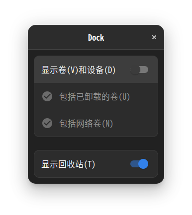

# ubuntu重装指南

> ~~ps: 本人菜鸡，重装自用~~

## 基础设置

### clash联网

1.关机按钮上面的设置 => Network => 网络代理 => 手动

> HTTP 127.0.0.1 7890

> HTTPS 127.0.0.1 7890

> Socks主机 127.0.0.1 7890 

> FTP和最后一栏忽略主机保持默认

2.解压如Clash.for.Windows-0.20.31-x64-linux.tar.gz包

> 在父目录下执行

```shell
./cfw
```

> 然后在Profiles里导入规则，复制订阅链接点击Download即可（在firefox浏览器里登录机场拿订阅地址）
>
> PS：建议稍微配置一下firefox的默认搜索引擎为Bing，快捷搜索Bing => Goole 即可~~firefox工具人，主用chrome~~
>
> 

> 在General里勾选Start with Linux选项

> 在Setting => Appearance => Theme => 勾选Cyberpunk主题

### 系统语言汉化

1.在软件与更新里面

> Ubuntu软件 => 下载自 => China => mirrors.huaweicloud.com

> => 关闭 =>  更新缓存

2.语言支持里面

> 补全语言的弹窗确定 => 等待下载完成 =>

> 将汉语（中国）提到最上面 => 点击应用到整个系统 =>

> 系统注销 => 登陆 => 再打开语言与支持 => 补全语言的弹窗确定 =>

> 等待下载完成 => 系统注销 => 此时再登陆就是中文了 => 弹窗保留旧名称并勾选不再提示

### 时间同步

```shell
sudo apt-get install ntpdate
sudo ntpdate time.windows.com
sudo hwclock --localtime --systohc
```

### 设置底部dock栏


> 设置Dock =>  自动隐藏Dock打开 => 面板模式关闭  => 屏幕上的位置底部 => 配置Dock行为



### 添加输入法

> 关机按钮上面的设置 => 键盘 => 输入源 => +号

> => 汉语 => 中文（智能拼音）=> 将中文（智能拼音）提到最上面

### 彻底卸载fcitx解决无法输入中文

> 第一步：

```
sudo apt-get remove fcitx*
sudo apt-get purge fcitx*
```

> 第二步：

> 注销并重新登录

### zsh安装以及oh-my-zsh终端美化

```shell
sudo apt-get install zsh
chsh -s /bin/zsh
```

> 注销登陆激活zsh

> 逐条执行

```shell
sudo apt-get install curl wget axel git gcc g++ gdb vim
```

```shell
sh -c "$(curl -fsSL https://raw.githubusercontent.com/ohmyzsh/ohmyzsh/master/tools/install.sh)"
```

```shell
git clone https://gitee.com/hailin_cool/zsh-autosuggestions.git $ZSH_CUSTOM/plugins/zsh-autosuggestions
git clone https://github.com/zsh-users/zsh-syntax-highlighting.git ${ZSH_CUSTOM:-~/.oh-my-zsh/custom}/plugins/zsh-syntax-highlighting
git clone https://github.com/romkatv/powerlevel10k.git $ZSH_CUSTOM/themes/powerlevel10k
```

```shell
vim ~/.zshrc
```

> 编辑 `~/.zshrc` 设置 （按下i键进入编辑模式，方向键移动）`ZSH_THEME="powerlevel10k/powerlevel10k".`

> 再增加一行配置:`POWERLEVEL9K_MODE="awesome-patched"`即

> 注意替换

```
ZSH_THEME="powerlevel10k/powerlevel10k
POWERLEVEL9K_MODE="awesome-patched"
```

> 在.zshrc里面找到plugins，在plugins里面加上zsh-autosuggestions和zsh-syntax-highlighting即

> 注意替换

```
plugins=(git zsh-autosuggestions zsh-syntax-highlighting)
```

> 保存后退出执行如下命令：（按下Esc键 => 输入:wq后回车）

```shell
source ~/.zshrc
```

> 配置power10k主题选项选择如果不满意可在终端运行

```shell
p10k configure
```

> 进行重新选择

### 卸载自带预装软件

> 卸载libreoffices

```shell
sudo apt-get remove libreoffice-common
```

> 删除Amazon广告图标

```shell
sudo rm -f /usr/share/applications/com.canonical.launcher.amazon.desktop

sudo rm -f /usr/share/applications/ubuntu-amazon-default.desktop
```

> 删除多余的软件

```shell
sudo apt-get remove thunderbird totem empathy brasero simple-scan gnome-mahjongg aisleriot gnome-mines cheese transmission-common gnome-orca  gnome-sudoku
```

> 卸载libreoffice相关

```shell
sudo apt remove libreoffice*
```

> 清除libreoffice配置文件

```shell
sudo apt purge libreoffice*

sudo apt autoremove
```


### nodejs npm yarn n pnpm的安装与配置（可选）

```shell
sudo apt-get install nodejs npm
```

```
sudo chown -R $(whoami) /usr/local
sudo chown -R $(whoami) $(npm get cache)
```

```
npm install -g yarn
```

```
sudo chown -R $(whoami) $(yarn cache dir)
sudo chown -R $(whoami) ~/.npm
sudo chown -R $(whoami) $(npm config get prefix)/{lib/node_modules,bin,share}
sudo chown -R $USER:$GROUP ~/.npm
```

```
npm install -g n
```

```
n lts
```

```
sudo apt-get remove nodejs
```

```
npm install -g pnpm 
npm config set registry https://registry.npmmirror.com
yarn config set registry https://registry.npmmirror.com/
pnpm config set registry https://registry.npmmirror.com
```

### 安装vue-cli和vite（可选）

#### vue-cli

```shell
yarn global add @vue/cli
```

#### vite

```shell
pnpm create vue 
```

### 安装常用软件

G4Music

```shell
sudo apt-get install flatpak
sudo flatpak remote-add --if-not-exists flathub https://flathub.org/repo/flathub.flatpakrepo
sudo apt install gnome-software-plugin-flatpak
flatpak install flathub com.github.neithern.g4music
```

可直接注销再登录此时会出现g4music的图标也可以直接运行

```shell
flatpak run com.github.neithern.g4music
```

qimgv(会附带安装mpv媒体播放器)

```shell
sudo apt-get install qimgv
```

> 设置 => 默认应用程序 => 照片 => qimgv

flameshot

```shell
sudo apt-get install flameshot 
```

> 设置 => 键盘 => 键盘快捷键 => 查看及自定义快捷键 => 自定义快捷键

> 火焰截图快捷键点击分享后类似Windows上的Snipaste

```
flameshot gui
```

> 系统监视器快捷启动

```
gnome-system-monitor
```


## 系统美化

### gnome扩展

> 建议chrome官网下载amd64位的deb包（~~不要在flathub里下,不能用gnome插件差评~~）

https://www.google.cn/intl/zh-CN/chrome/

> 然后在下载目录Download下运行终端可灵活运用tab键补全

```shell
sudo dpkg -i google-chrome-stable_current_amd64.deb
```

> 安装完成后可登录谷歌账号云同步

> 建议下载chrome插件	GNOME Shell 集成

https://chrome.google.com/webstore/detail/gnome-shell-integration/gphhapmejobijbbhgpjhcjognlahblep

```shell
sudo apt-get update
sudo apt-get install gnome-tweaks
sudo apt-get install chrome-gnome-shell
```

https://extensions.gnome.org/


### 外观美化

主题美化

https://www.gnome-look.org/browse/

> 优化藏在工具文件夹里


#### theme目录提供

> candy-icons 图标 

使用方法 用sudo mv 旧文件夹 新文件夹 例：

```
sudo mv candy-icons /usr/share/icons
```

> Skyrim-by-ru5tyshark-cursors 光标

使用方法 用sudo mv 旧文件夹 新文件夹 例：

```
sudo mv Skyrim-by-ru5tyshark-cursors /usr/share/icons
```

> Vimix-1080p grub启动页面美化

```
sudo ./install.sh
```

#### git拉取

> Orchis-theme窗口美化

```
git clone https://github.com/vinceliuice/Orchis-theme.git
cd Orchis-theme
./install.sh
```

### 字体设置


### 附录

> ~~附两张张好看的壁纸~~


> ~~附一张头像~~


> 完全体展示（~~中间省略了亿点点~~）


